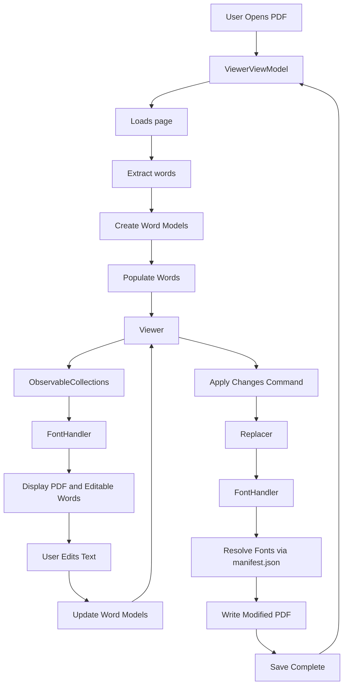

#       Aris  _~\[+]\~_ 

Aris is a WPF MVVM PDF editor that uses OCR-based text replacement.

In here I'll explain Project [Structure](https://github.com/HinacioSant/Aris/blob/main/Architecture.md#structure), file [Responsibilities](https://github.com/HinacioSant/Aris/blob/main/Architecture.md#responsibilities), important [Classes](https://github.com/HinacioSant/Aris/blob/main/Architecture.md#classes) and [Data](https://github.com/HinacioSant/Aris/blob/main/Architecture.md#data-flow) flow.

# Data Flow 

# Structure

| Folder | Description |
| --- | --- |
| Fonts/ | Personalized fonts(outside the standard 14) for editing and displaying |
| Helpers/ | Helper holds all the UI text based animation |
| Models/ | Models hold the all records and models including result for error handling  |
| Pages/ | WPF pages |
| Services/ | Error handling, Font management, Page sizing, Json handling, Nav Services, Output path generation, [Text Extraction, Extraction filtering and word duplication handling and PDF word replacing logic], PDF Loading  |
| Themes/ | UI Styling |

"I'm aware of the need to decople certain files and reorganisation"

# Responsibilities

| File | Description |
| --- | --- |
| MainWindow | Base UI and navgation |
| Pages/Home | File upload  |
| Pages/Viewer | UI of PDF Loading, displaying and editing |
| Services | Heavy operation like OCR, PDF manipulation, Extracted text filtering |

# Classes 

## PdfHandler/ 

### **Extractor**
**Extract** from the PDF all its words, then using a filter will organize letter into words (Specificly needed for factured extraction), then it will use the functions **DuplicationHandler**, **CheckBoxOverlap**, **XrangeOverlap** to check if any of the extracted words are old/duplicated words and it will keep the newer word as a default.

### **Replacer**

handle PDF manipulation.

## FontHandler/**GetFont**

Locates fonts, reads manifest.json and resolves font names.

## Models/**Word_Model**

Represents an editable OCR word.

## ViewModel/**ViewerViewModel**

Loads PDF, coordinates application state and user commands.

