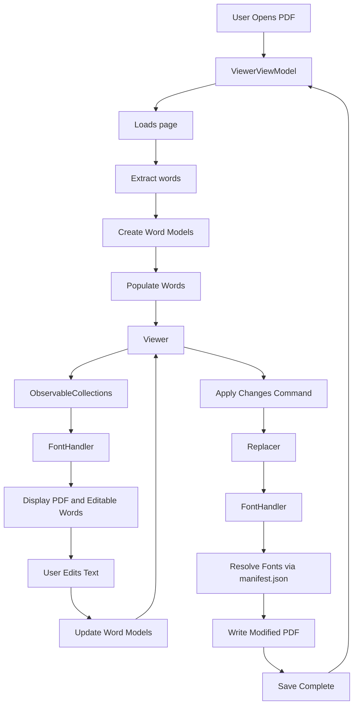

#       Aris  _~\[+]\~_ 

Aris is a WPF MVVM PDF editor that uses OCR-based text replacement.

In here I'll explain Project [Structure](https://github.com/HinacioSant/Aris/blob/main/Architecture.md#structure), file [Responsibilities](https://github.com/HinacioSant/Aris/blob/main/Architecture.md#responsibilities), important [Classes](https://github.com/HinacioSant/Aris/blob/main/Architecture.md#classes), [Data flow](https://github.com/HinacioSant/Aris/blob/main/Architecture.md#data-flow)  and [Design decisions](https://github.com/HinacioSant/Aris/blob/main/Architecture.md#design-decisions)

# Data Flow 

# Structure

| Folder | Description |
| --- | --- |
| Fonts/ | Personalized fonts(outside the standard 14) for editing and displaying |
| Helpers/ | Helper holds all the UI text based animation |
| Models/ | Models hold the all records and models including result for error handling  |
| Pages/ | WPF pages |
| Services/ | Error handling, Font management, Page sizing, Json handling, Nav Services, Output path generation, [Text Extraction, Extraction filtering and word duplication handling and PDF word replacing logic], PDF Loading  |
| Themes/ | UI Styling |

"I'm aware of the need to decouple certain files and reorganisation"

# Responsibilities

| File | Description |
| --- | --- |
| MainWindow | Base UI and navigation |
| Pages/Home | File upload  |
| Pages/Viewer | UI of PDF Loading, displaying and editing |
| Services | Heavy operation like OCR, PDF manipulation, Extracted text filtering |

# Classes 

## PdfHandler/ 

### **Extractor**
**Extract** from the PDF all its words, then using a filter will organize letter into words (Specificly needed for fractured extraction), then it will use the functions **DuplicationHandler**, **CheckBoxOverlap**, **XrangeOverlap** to check if any of the extracted words are old/duplicated words and it will keep the newer word as a default.

### **Replacer**

handle PDF manipulation.

Creates a temp file. 

The Words dictionary has every page changed words, and replacer will loop through each page editing the needed words in the temp file.

If there is already a edited version of this file(e.g [Edited]-PDF1) in its folder will replace it with the temp file(e.g [Edited]-PDF1).

If a exception is thrown replacer will delete the temp file.

## FontHandler/**GetFont**

Locates fonts, reads manifest.json and resolves font names.

GetFont has two main methods LoadFont(Replacer) and GetTextBlockFont(Display font).

Each have their own formating and location methods for fonts.

## Models/**Word_Model**

Represents an editable OCR word.

Each extracted word is a Word_Model used for display and edit.

## ViewModel/**ViewerViewModel**

Loads PDF, coordinates application state and user commands.

LoadPage calls PageSelection. Each page has OnPageChange action which will call OnPageArrive and if leaving a page it will call OnPageLeave.

OnPageArrive will call a async task PopulateWords which will display all extracted words then check if the page has any words that were saved in _ChangesPerPage if so it will display it.

# Design decisions

### **Libraries**

Why three differents libraries ?. Each of then do a distinct function.

PdfPig - Handles extraction.

PdfiumViewer.Updated - Handles displaying the PDF in viewer.

Itext7 - Handles edits and PDF manipulation in general.

### **Fonts**

Fonts names extracted from the file must be formated so it can be found within Fonts folder as they often will be extracted like "BAAAAA+Merriweather-Regular" while their internal name is "Merriweather". 

Font handler has two different font loaders GetTextBlockFont for the viewer display and LoadFont for editing as load font uses PdfFontFactory from itext7 to create the font and GetTextBlockFont is a System.Windows.Media.FontFamily.

Each of these fuctions have their own formatting of the extracted font name.

### **Disposal**

Each page has to be disposed after its use Mainly Viewer as for a file to be edited it can't be also open in viewer. This would appear when re-editing a file, for example you open PDF1 then edit when Aris finishes a edit Aris will load viewer with the new file now [Edited-]PDF1 so if you were to edit again it would throw a exception as [Edited-]PDF1 is already open in Aris.

Pages.Viewer wraps PdfiumViewer, which holds a native, unmanaged file handle to the open PDF. The .NET garbage collector doesn't know how to release that — only calling .Dispose() does. Skipping it meant that the old PDF file could stay locked on disk even after the user navigated away.

 **-Fix-**  

This was solved by centralizing disposal to the navigation system using IDisposable pattern-matching in a generic SetContent method specifically to handle this uniformly across pages

### **Known bugs**

#### *Extraction*

- If extracting words from a edited file specially if the same word has been edited multiple times it will lead to corruption of the word, from multiple versions of the word being extracted to parts of the versions meshing together. Even with the multiple filters and deduplications in Extractor the bug still happens. the most concrete solution that I've come up with is to actually delete the word Tj/TJ operators from the PDF which my intent is to port PdfCanvasEditor for it.

- If you "delete" a word from a file by replacing it with a whitespace it will still appear on the extraction. It is a harmless bug as it is only a visual bug from the extraction. the whitespace will cover the word in the actual PDF file. Aris extraction as it is right just ignore whitespaces a probable solution is to check if the whitespace overlap with a word if so replace the word in the extraction List with it. pretty close of what DeduplicationHandler already does with words.

#### *Viewer*

- The extracted words are displayed by their coordinates on their respective PDF file, so if for example there's a variation in size on Fonts. They may clutter. Also a visual bug.

- Similar with the previous bug if you change a word to a much bigger word they may stack as the words can't self organize.

